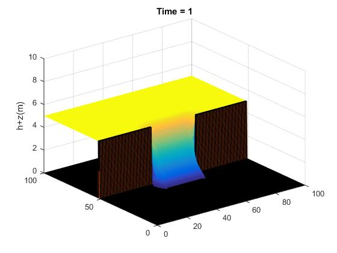
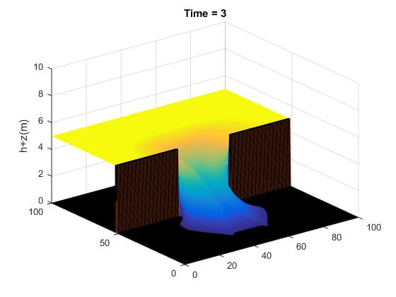
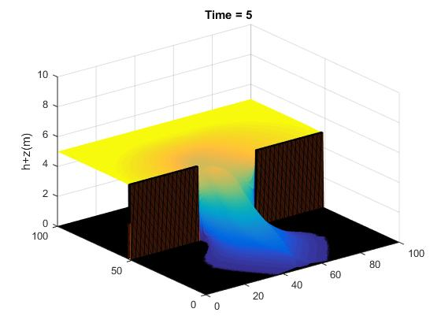

# SWE_with_MUSCL-Hancock
Solve The Shallow Water Equations with Finite volume method and approximate the numerical flux by Haten-Lax-van Leer contact.
The MUSCL–Hancock method is adopted to achieve over all second-order accuracy.
The bed slope is estimated using the central-differencing scheme.

Example of case 4 Dam Dry

The water flows from the dam to the other side where the ground is dry.

(ลัษณะการไหลของน้ำจากเขื่อนไปยังอีกฝั่งหนึ่งที่มีลักษณะเป็นพื้นแห้ง)

  
