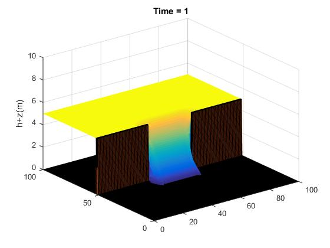
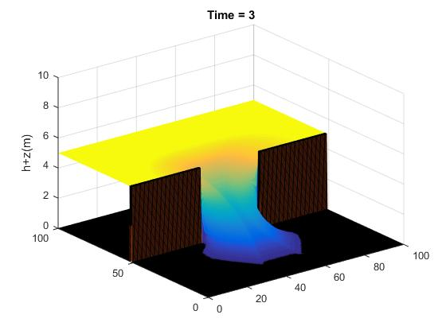

# SWE_with_MUSCL-Hancock

Solve The Shallow Water Equations with Finite volume method and approximate the numerical flux by Haten-Lax-van Leer contact.
The MUSCL–Hancock method is adopted to achieve over all second-order accuracy.
The bed slope is estimated using the central-differencing scheme.

---

## Repository Structure

```
matlab/          — MATLAB case scripts and shared utility
python/          — Python 1D solver port with pytest suite
```

---

## Cases

| File | Dimensions | Domain | Cells | Steps | Scenario |
|------|-----------|--------|-------|-------|----------|
| `matlab/case_1_1d_hump_and_exact.m` | 1D | 1000 m | 41 | 2522 | Flow over cosine hump, compared to exact solution |
| `matlab/case_2_circle_dam_break.m` | 2D | 200×200 m | 85×85 | 200 | Circular dam break, radial propagation |
| `matlab/case_3_water_flowing_through_the_river.m` | 2D | 6×6 m | 60×60 | 600 | River flow with natural topography |
| `matlab/case_4_dam_dry.m` | 2D | 100×100 m | 200×200 | 350 | Dam break onto dry ground through a gate |

Example of case 4 Dam (Dry) — water flows from the dam through the gate onto dry ground.

(ลักษณะน้ำที่ไหลจากเขื่อนผ่านประตูไปยังอีกฝั่งหนึ่งที่มีลักษณะพื้นแห้ง)

  

---

## Running the Code (MATLAB)

Each case script is self-contained and run directly in MATLAB:

```matlab
run('matlab/case_1_1d_hump_and_exact.m')
run('matlab/case_2_circle_dam_break.m')
run('matlab/case_3_water_flowing_through_the_river.m')
run('matlab/case_4_dam_dry.m')
```

Each script uses `clear` and `close all` at the top, so they can be run independently.

---

## Numerical Algorithm

All cases implement the same two-stage MUSCL-Hancock pipeline:

### State Variables (per cell)
- `h` — water depth
- `eta` — water surface elevation (`eta = h + z`)
- `hu`, `hv` — discharge (momentum) in x and y directions
- `z` — bed topography elevation
- `zbx`, `zby` — interface topography value (well-balancing)

### Grid Layout
Arrays are sized `n+4` for `n` interior cells, with 2 ghost layers on each side. Interior cells occupy indices `3:n+2`; flux loops run over `3:n+3`.

### Two-Stage Update (per time step)
1. **Slope limiting** via `minmod()` for `h`, `eta`, `hu`/`hv` on both sides of each interface.
2. **Data reconstruction** — piecewise-linear extrapolation to cell faces.
3. **Well-balancing fix** — `zbx(i) = max(zl, zr)`, then recompute `hl = max(0, etal - zbx(i))`.
4. **HLLC flux computation** — wave speeds `Sl`, `Sr`, `Sm`; flux selected from left/middle/right region.
5. **Solution update** — flux divergence + bed slope source term, factor `0.5*dt/dx`.
6. Repeat stages 1–5 (completing the full Hancock two-stage predictor-corrector).

### Key Constants
- `grav = 9.806` m/s²
- Dry-bed threshold: `h < 1.0e-06` — velocity set to zero to avoid division by near-zero depth
- CFL factor: `dt = 0.5 * dx / max(|u| + sqrt(g*h))`

### Bed Slope Source Term
```
sox = ((hlx(i+1) + hrx(i)) / 2) * ((zbx(i+1) - zbx(i)) / dx)
```

### 2D Extension
Cases 2–4 use **operator splitting** (x-sweep then y-sweep per time step):
```matlab
dt = 0.5 / (max(max(abs(u)+sqrt(grav*h)))/dx + max(max(abs(v)+sqrt(grav*h)))/dy)
```

### Shared Utility
`matlab/minmod.m` — slope limiter: returns the smaller-magnitude value if both have the same sign, otherwise 0.

---

## Bug Fixes

**Positivity and dry-bed handling** (`case_2`, `case_3`, `case_4`): Fixed spurious flow on dry cells by enforcing the dry-bed threshold and flooring negative depths to zero after each update. This allows stable simulation over non-flat terrain and dry-ground dam-break scenarios.

---

## Python Port

A Python implementation of the 1D solver (port of `case_1`) is available in the [`python/`](python/) directory.

**Requirements:** Python 3.x, NumPy, pytest

**Files:**
- [`python/swe_muscl_hancock.py`](python/swe_muscl_hancock.py) — solver library (MUSCL-Hancock + HLLC, boundary conditions, time stepping)
- [`python/test_swe.py`](python/test_swe.py) — pytest test suite

**Run tests:**
```bash
cd python
pytest test_swe.py
```

**Basic usage:**
```python
import numpy as np
from swe_muscl_hancock import make_grid, run

n = 41
x, dx = make_grid(0, 1000, n)

z   = np.zeros(n + 4)          # flat bed
h0  = np.ones(n + 4) * 2.0     # initial water depth
hu0 = np.zeros(n + 4)          # at rest

h, eta, hu, times = run(z, h0, hu0, n, dx, nt=500)
```
