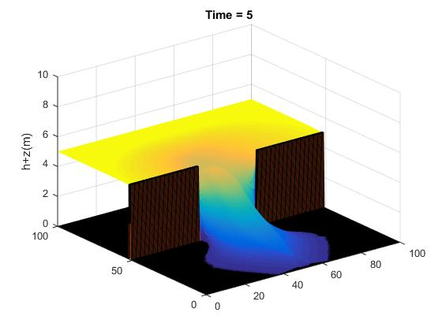

# SWE_with_MUSCL-Hancock
Solve The Shallow Water Equations with Finite volume method and approximate the numerical flux by Haten-Lax-van Leer contact.
The MUSCL–Hancock method is adopted to achieve over all second-order accuracy.
The bed slope is estimated using the central-differencing scheme.


Example of case 4 Dam (Dry)

The water that flows from the dam through the gate to the other side is characterized by dry ground.

(ลักษณะน้ำที่ไหลจากเขื่อนผ่านประตูไปยังอีกฝั่งหนึ่งที่มีลักษณะพื้นแห้ง)

  

---

## Bug Fixes

**Positivity and dry-bed handling** (`case_2`, `case_3`, `case_4`): Fixed spurious flow on dry cells by enforcing a minimum depth threshold (`h < 1e-6`) and flooring negative depths to zero after each update. This allows stable simulation over non-flat terrain and dry-ground dam-break scenarios.

---

## Python Port

A Python implementation of the 1D solver (port of `case_1`) is available in the [`python/`](python/) directory.

**Requirements:** Python 3.x, NumPy, pytest

**Files:**
- [`python/swe_muscl_hancock.py`](python/swe_muscl_hancock.py) — solver library (MUSCL-Hancock + HLLC, boundary conditions, time stepping)
- [`python/test_swe.py`](python/test_swe.py) — pytest test suite

**Run tests:**
```bash
cd python
pytest test_swe.py
```

**Basic usage:**
```python
import numpy as np
from swe_muscl_hancock import make_grid, run

n = 41
x, dx = make_grid(0, 1000, n)

z   = np.zeros(n + 4)          # flat bed
h0  = np.ones(n + 4) * 2.0     # initial water depth
hu0 = np.zeros(n + 4)          # at rest

h, eta, hu, times = run(z, h0, hu0, n, dx, nt=500)
```
